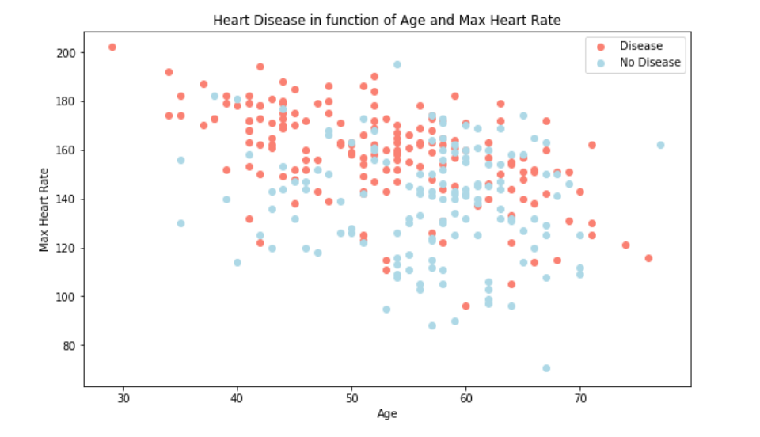
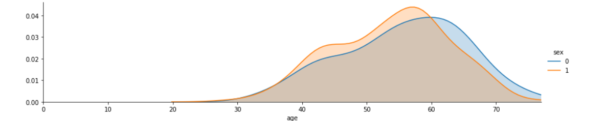
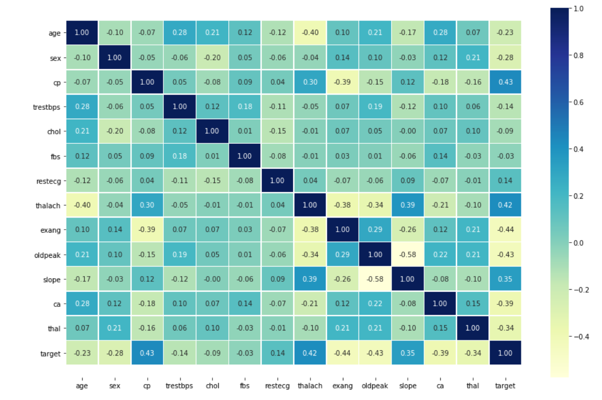
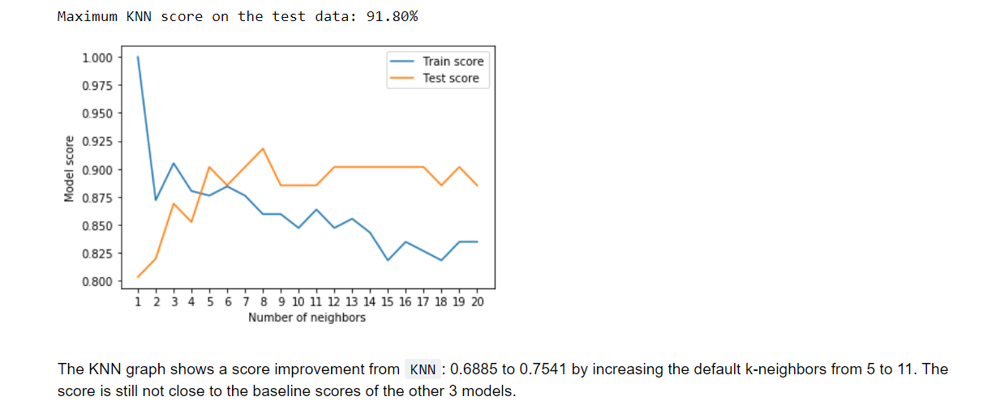
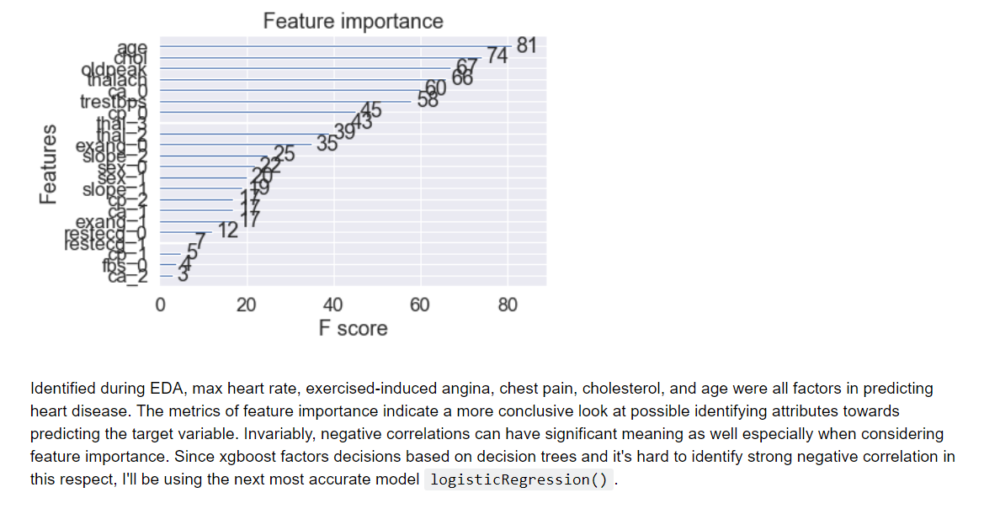

> Full analysis, predictions and models can be viewed here: [Jupyter Notebook](https://nbviewer.jupyter.org/github/t-shikuro/iNueron-Hackathon/blob/master/CardioVascularDisease/notebooks/heart-disease-classification%20%281%29.ipynb)

## Introduction

Heart disease is described as any condition that detrimentally affects the heart. Heart disease is often used interchangeably with the term “cardiovascular disease.” However, cardiovascular disease generally refers to conditions involving heart blockages such as atherosclerosis (narrowing or blocking of the arteries due to plaque buildup), whereas heart disease is an umbrella term that is inclusive of other heart conditions. Heart Disease can not only affect the arteries, but the heart muscle, valves, rhythm, or other important aspects of a well-functioning heart.

The pervasiveness of heart disease in the United States has merited the ailment as the leading cause of death in the United States. Here are a few statistics that emphasize how problematic heart disease has become in our society [1]:

About 610,000 people die of heart disease in the United States every year. That is 1 in every 4 deaths.
Heart disease is the leading cause of death for both men and women. More than half of the deaths due to heart disease in 2009 were in men.
Coronary heart disease (CHD) is the most common type of heart disease, killing over 370,000 people annually.
Every year about 735,000 Americans have a heart attack. Of these, 525,000 are a first heart attack and 210,000 happen in people who have already had a heart attack.
To illustrate the prevalence of heart disease, choropleth mapping shows comparative heart disease trends categorized by state, heart disease stratification, and gender using Tableau Public. The CDC’s Division of Population Health provides yearly statistics of over 124 chronic health disease indicators that are reported on a city and state level, available to download here. This dataset was cleaned and filtered using Pandas, then imported into Tableau Public. I provide the iPython Notebook for those who want to know the intricacies of the data preparation process. The other iPython notebooks and cleaned datasets can also be found in that Github repository. The Tableau workbook can be downloaded by clicking on the bottom right download icon of the frame ([reference](https://sokolj.com/Predicting-Heart-Disease-with-Machine-Learning/)).

## Overview

This notebook looks into using various Python-based machine learning and data science libraries in an attempt to build a machine learning model capable of predicting whether or not someone has heart disease based on their medical attributes.

## 1. Problem Definition

To build an application to classify the patients to be healthy or suffering from cardiovascular disease based on the given attributes. In this case, the problem will be exploring **binary classification**. By evaluating a number of **features** regarding a patient can heart disease be predicted and thus, prevented through healthier lifestyle choices (features).

In a statement,

> Given clinical parameters about a patient, can we predict whether or not they have heart disease?

## 2. Data

The data source is from the [Cleveland database](https://archive.ics.uci.edu/ml/datasets/heart+Disease) from UCI Machine Learning Repository and part of [iNeuron's Machine Learning Challenge](https://challenge-ineuron.in/mlchallenge.php#) hackathon challenge.

The original database contained 76 attributes, but only 14 attributes will be used. **Attributes** (also called **features**) are the variables what we'll use to predict our **target variable**.

## 3. Evaluation

> Given the serious nature of heart disease, a goal of 93% accuracy at predicting whether or not a patient has heart disease must be obtained to continue with the machine learning model.

## 4. Features

### Heart Disease Data Dictionary

The following are the features to be used for predicting heart disease.

1. age - age in years
2. sex - (1 = male; 0 = female)
3. cp - chest pain type
    * 0: Typical angina: chest pain related decrease blood supply to the heart
    * 1: Atypical angina: chest pain not related to heart
    * 2: Non-anginal pain: typically esophageal spasms (non heart related)
    * 3: Asymptomatic: chest pain not showing signs of disease
4. trestbps - resting blood pressure (in mm Hg on admission to the hospital)
    * anything above 130-140 is typically cause for concern
5. chol - serum cholestoral in mg/dl
    * serum = LDL + HDL + .2 * triglycerides
    * above 200 is cause for concern
6. fbs - (fasting blood sugar > 120 mg/dl) (1 = true; 0 = false)
    * '>126' mg/dL signals diabetes
7. restecg - resting electrocardiographic results
    * 0: Nothing to note
    * 1: ST-T Wave abnormality
        - can range from mild symptoms to severe problems
        - signals non-normal heart beat
    * 2: Possible or definite left ventricular hypertrophy
        - Enlarged heart's main pumping chamber
8. thalach - maximum heart rate achieved
9. exang - exercise induced angina (1 = yes; 0 = no)
10. oldpeak - ST depression induced by exercise relative to rest
    * looks at stress of heart during excercise
    * unhealthy heart will stress more
11. slope - the slope of the peak exercise ST segment
    * 0: Upsloping: better heart rate with excercise (uncommon)
    * 1: Flatsloping: minimal change (typical healthy heart)
    * 2: Downslopins: signs of unhealthy heart
12. ca - number of major vessels (0-3) colored by flourosopy
    * colored vessel means the doctor can see the blood passing through
    * the more blood movement the better (no clots)
13. thal - thalium stress result
    * 1,3: normal
    * 6: fixed defect: used to be defect but ok now
    * 7: reversable defect: no proper blood movement when excercising
14. target - have disease or not (1=yes, 0=no) (= the predicted attribute)

**No personal identifiable information (PPI) was included in this dataset.**

## Exploratory Data Analysis

Preliminary EDA shows the increase of heart disease prevalence as age increase as expected.

> Age distribution showing greater amount of younger males compared to younger females
> 

`Correlation Matrix`

> 
Even based on the initial EDA, it was observed that attributes such as cp (chest pain) or thalach (max heart rate) were strong indicators of a patient's susceptibility to heart disease (target=1). The above correlation matrix confirms the initial analysis along with identifying significant negative correlations exang (exercise induced angina) and ca (blood vessel condition), which contribute to patient's resistance towards obtaining heart disease issues (target=0).

`KNN modelling`
> Tweaking k-neighbors to 11 didn't yeild a high enough accuracy compared to `xgboost` and `LinearRegression()` models:
> 

For full details of EDA and modelling view full Jupyter notebook link at the top.

# Conclusion

To continue with future model deployment, feature selection should include the important features which contributed most to the heart disease prediction. Following hyperparameter tuning of the `XGBoost` the model was able to predict with ~94% accuracy as well as 86% precision marker.
> 
