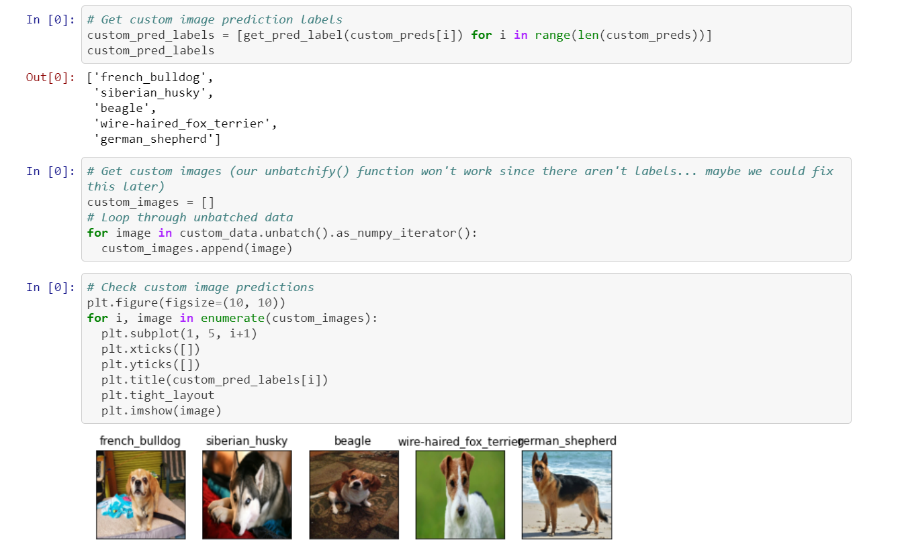

> Full analysis, predictions and models can be viewed here: [Jupyter Notebook](https://nbviewer.jupyter.org/github/t-shikuro/dog-breed-id/blob/master/notebooks/dog-vision.ipynb).

## Overview

🚜 This project was based on the Dog Breed Identification [Kaggle competition](https://www.kaggle.com/c/dog-breed-identification/data?select=test). The data includes training and test set of dog images each with a unique `id`. The dataset comprises 120 dog breeds and the aim is to create a classifier able to determine the dog's breed based on dog photos (example: this is my dog Scoobie who died in late 2019 - he lived a long live 17 years!).

> RIP buddy
> 

So... how well can machine learning and specifically Tensorflow predict a dog's breed based just on jpeg image? That's what I'm about to find out!

## Introduction
How does image classification work? Given a set of images that are all labeled with a single category, we are asked to predict these categories for a novel set of test images and measure the accuracy of the predictions. There are a variety of challenges associated with this task, including viewpoint variation, scale variation, intra-class variation, image deformation, image occlusion, illumination conditions, background clutter etc.

How to construct an algorithm that classifies images into distinct categories? Computer Vision researchers have come up with a data-driven approach to solve this. Instead of trying to specify what every one of the image categories of interest looks like directly in code, they provide the computer with many examples of each image class and then develop learning algorithms that look at these examples and learn about the visual appearance of each class. In other words, they first accumulate a training dataset of labeled images, then feed it to the computer in order for it to get familiar with the data ([reference](https://medium.com/nanonets/how-to-easily-build-a-dog-breed-image-classification-model-2fd214419cde)).
> 

## Exploratory Data analysis

> Dog Breed count
> 

> Breed List
> 

> Sample view of data and labels
> 

For detailed EDA and modelling processes view full jupyter notebook
## Evaluation

Submissions are evaluated on Multi Class Log Loss between the predicted probability and the observed target.

- For more on the evaluation of this project check: https://www.kaggle.com/c/dog-breed-identification/overview/evaluation

## Data

### File descriptions

- `train.zip` - the training set, you are provided the breed for these dogs
- `test.zip` - the test set, you must predict the probability of each breed for each image
- `sample_submission.csv` - a sample submission file in the correct format
- `labels.csv` - the breeds for the images in the train set

* For more on the evaluation of this project check: https://www.kaggle.com/c/dog-breed-identification/overview/evaluation

## List of Breeds

> Kaggle provides a full list of breeds included in this dataset. It can be viewed at https://www.kaggle.com/c/dog-breed-identification/data

## Final Takeaway

> Predictions on custom images
> 

The takeaway from this project is working with batches. In the case of images usually one image file doesn't expend too much of a file size, however, loading and converting hundreds or even thousands of images can take a long time. By converting the images to a Tensor format: (image, label) the system works with tuple shape (224,224,3). The specific [Keras](https://www.tensorflow.org/api_docs/python/tf/keras/applications/MobileNetV2) model used for this project was `mobilenetv2-Adam`
