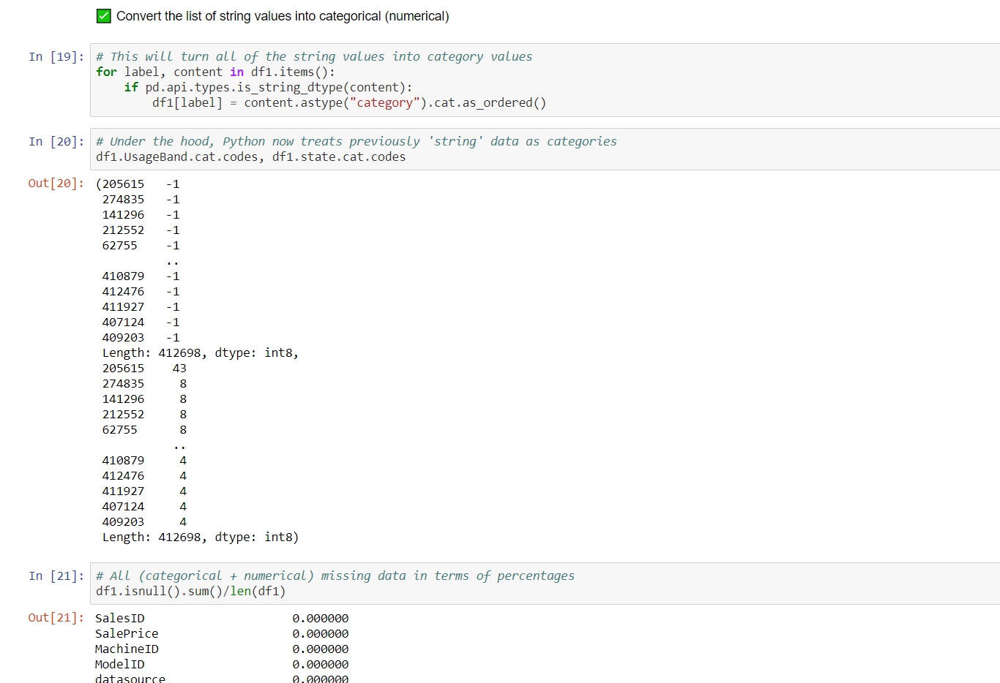
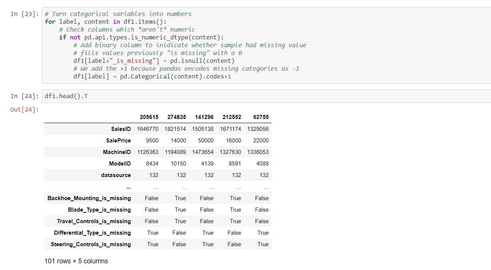
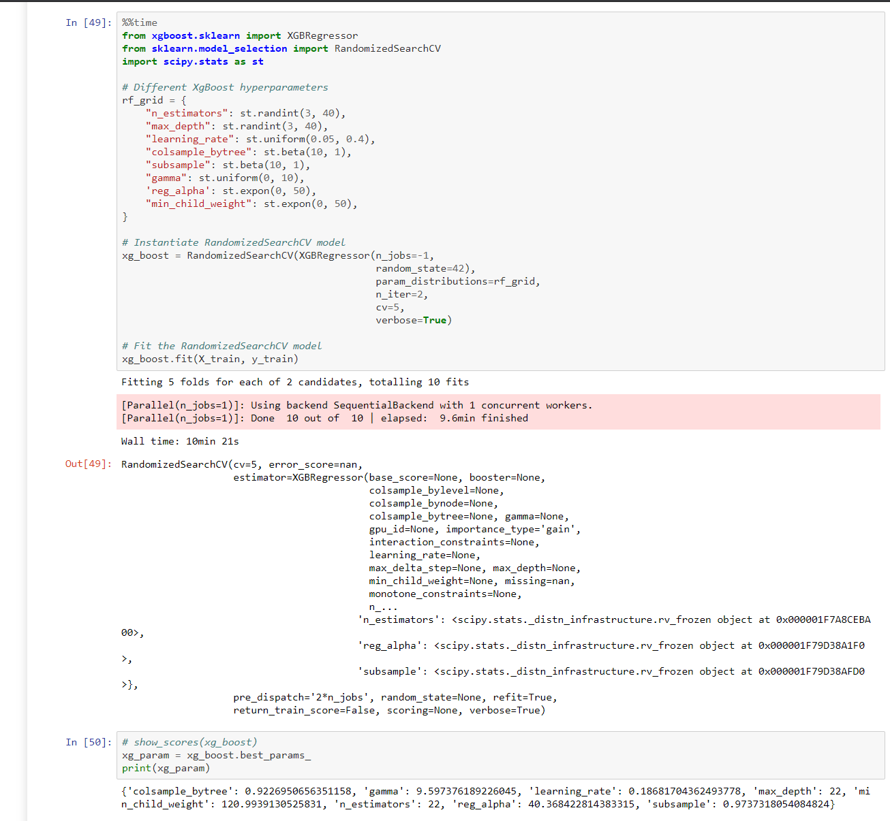
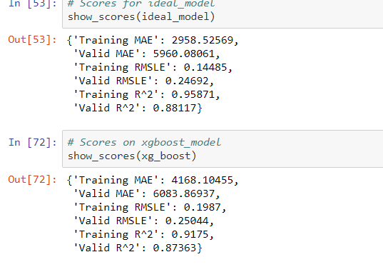
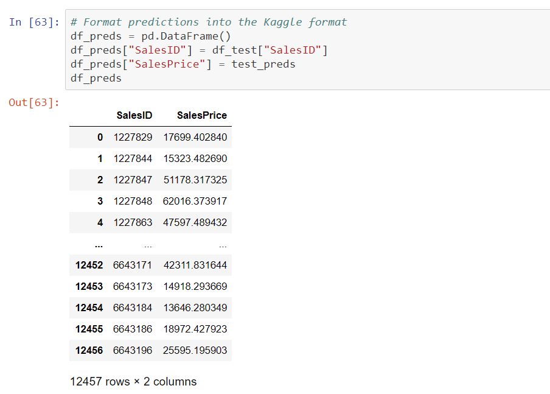
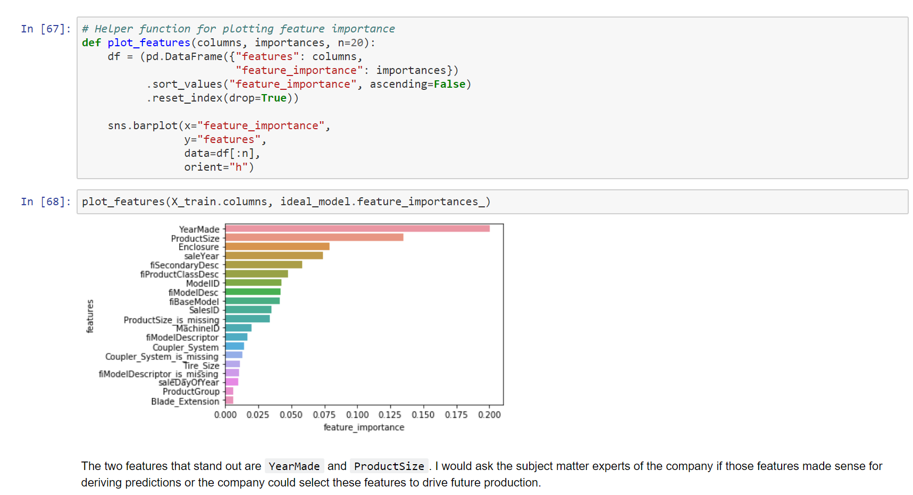

> Click [_HERE_](https://t-shikuro.github.io/Bulldozer-Blue-Book-Prediction/) for entire analysis, predictions, and results

## Overview

This project was originally a [Kaggle competition](https://www.kaggle.com/c/bluebook-for-bulldozers/data) aimed at predicting the future sales price of bulldozer models using past sales data. For prediction purposes, this was a regression-based problem where ultimately I decided to try both `RandomForestRegressor` and `XgBoost` models. This project showcases data wrangling and transformation skills (missing values, categorical features, structuring datatypes, and textual columns) in order to preprocess the data for modelling.

## Data

> Consists of Train.csv, Valid.csv, and Test.csv separated by dates downloaded from https://www.kaggle.com/c/bluebook-for-bulldozers/data

There are 3 main datasets:

- Train.csv is the training set, which contains data through the end of 2011.
- Valid.csv is the validation set, which contains data from January 1, 2012 - April 30, 2012 You make predictions on this set throughout the majority of the competition. Your score on this set is used to create the public leaderboard.
- Test.csv is the test set, which won't be released until the last week of the competition. It contains data from May 1, 2012 - November 2012. Your score on the test set determines your final rank for the competition.
- For more on the evaluation of this project check: https://www.kaggle.com/c/bluebook-for-bulldozers/overview/evaluation

## Exploratory Data Analysis

Handling missing values

> filling with median
> 

`scikit-learn` modelling

> converting strings to integers:
> 

> converting categories to numerical:
> 

This project consists of time-series based features where many instances of date-based feature engineering methods are used. In this instance, the training data preceeds 2012, validation data selected from 01/2012 - 04/2012, and the final testing data on 05/2012 - 11/2012.

## Evaluation

How well can a prediction be made on the future sale price of a bulldozer, given its characteristics and previous sales? The evaluation metric for the machine learning model was based on [RMSLE](https://medium.com/analytics-vidhya/root-mean-square-log-error-rmse-vs-rmlse-935c6cc1802a), a metric where a larger penalty is incurred if the predicted value is LESS THAN the actual value.

- Further specifics on the project evaluation can be found at https://www.kaggle.com/c/bluebook-for-bulldozers/overview/evaluation

`RandomizedSearchCV` for model tuning

> 

> `XGBoost` model scores and sample predictions:

## Features List

> Kaggle provides a data dictionary detailing all of the features of the dataset. It can be viewed on Google Sheets: https://docs.google.com/spreadsheets/d/18ly-bLR8sbDJLITkWG7ozKm8l3RyieQ2Fpgix-beSYI/edit?usp=sharing

## Conclusion

To continue with future model deployment, feature selection should include the important features which contributed most to the sales prediction. Following hyperparameter tuning of the `XGBoost` the model was able to predict with ~79% accuracy and a RMSLE score of 0.24692 placing it within the top 30 Kaggle rank.
